# My Score Tracker

[](https://github.com/pajcho/my-score-tracker/actions/workflows/ci.yml)

**My Score Tracker** is a mobile-first PWA for tracking **Pool** and **Ping Pong** games with
friends: live scoring with realtime sync, a fullscreen scoreboard for the table, match history,
head-to-head statistics and training logs — all in one place.

**▶ App: [pajcho.github.io/my-score-tracker](https://pajcho.github.io/my-score-tracker/)**
(private instance — you need an account to sign in)

|                       Home                        |                  Live scoring                  |                    Scoreboard mode                     |
| :-----------------------------------------------: | :--------------------------------------------: | :----------------------------------------------------: |
|        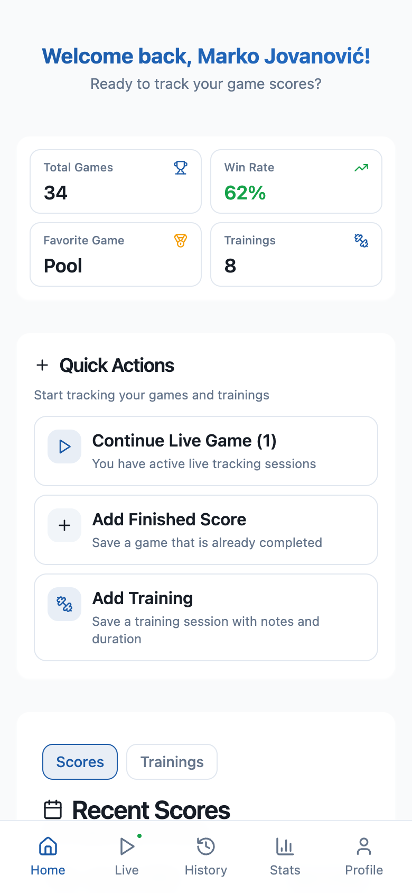         |    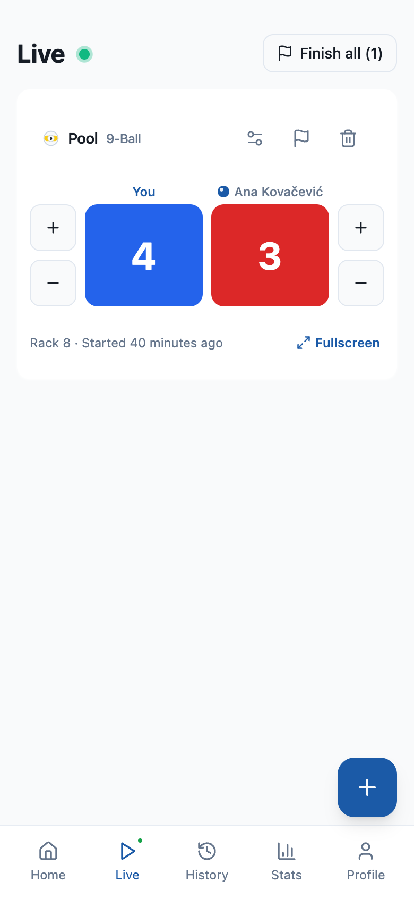  | 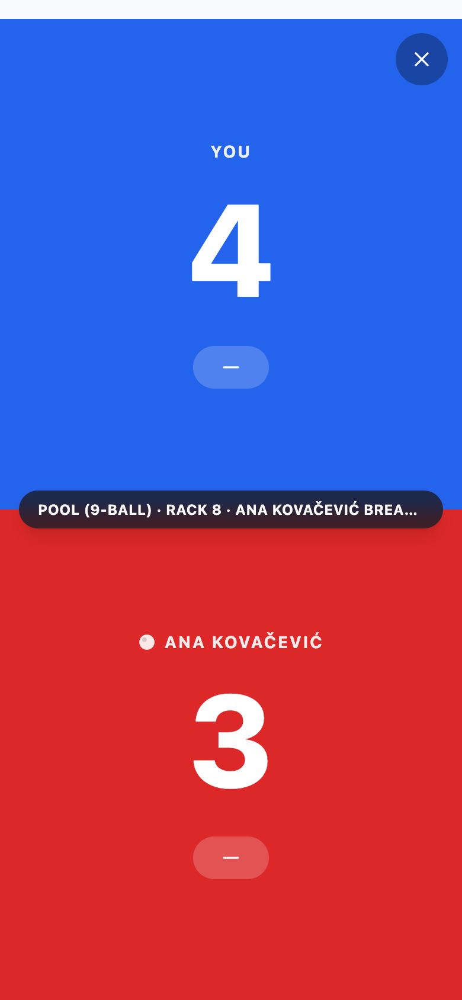    |
|                  **Game setup**                   |                **Match history**               |                     **Trainings**                      |
|     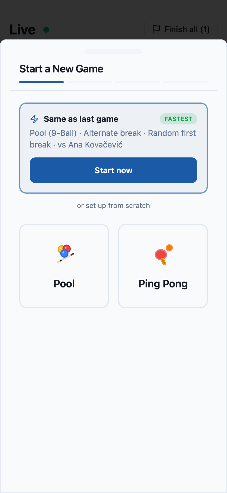    | 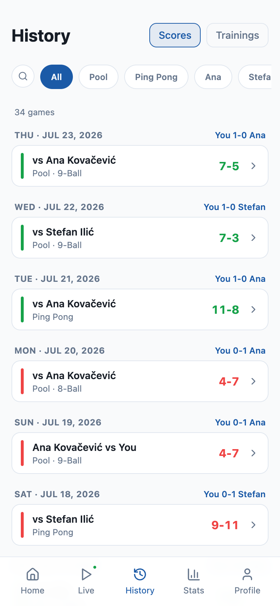 |     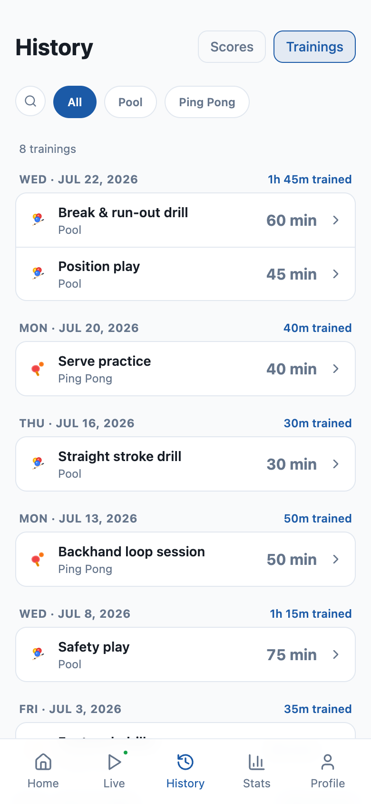       |
|                  **Statistics**                   |              **Charts & heatmap**              |                    **Head-to-head**                    |
|     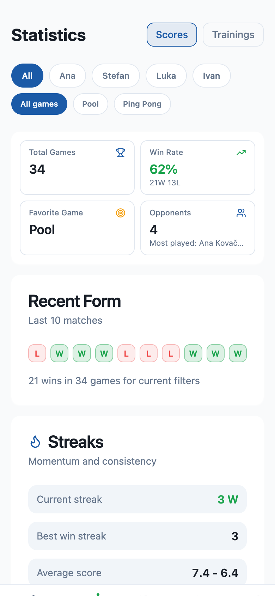     |   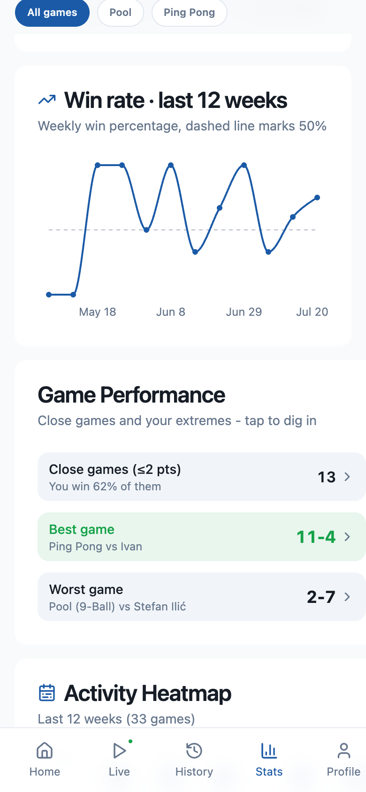 |  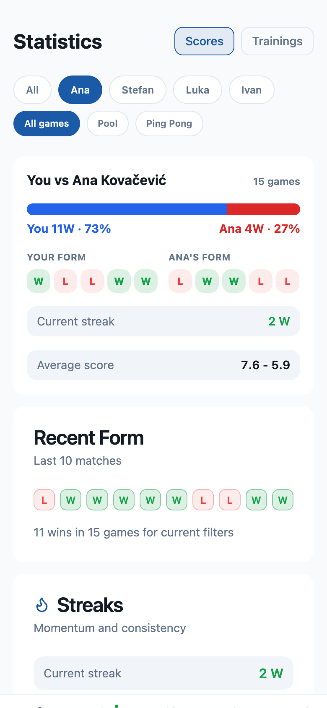    |
|                    **Friends**                    |                   **Profile**                  |                     **Dark theme**                     |
|      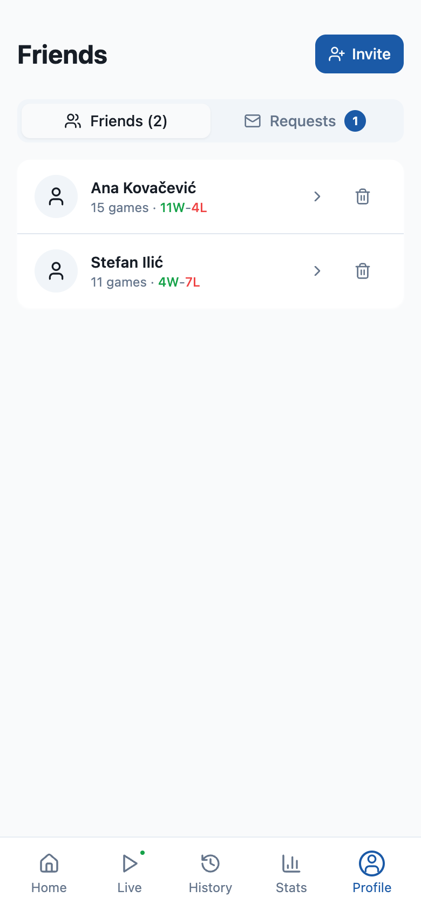     |     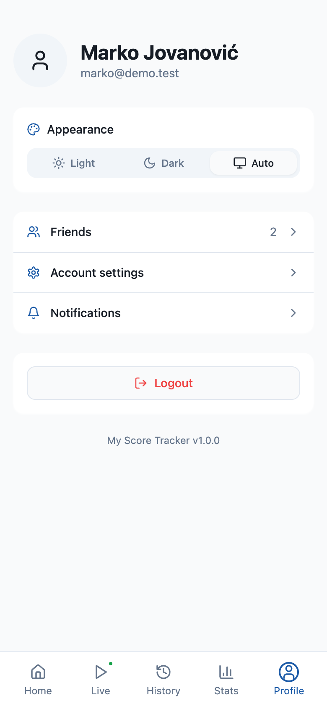   |    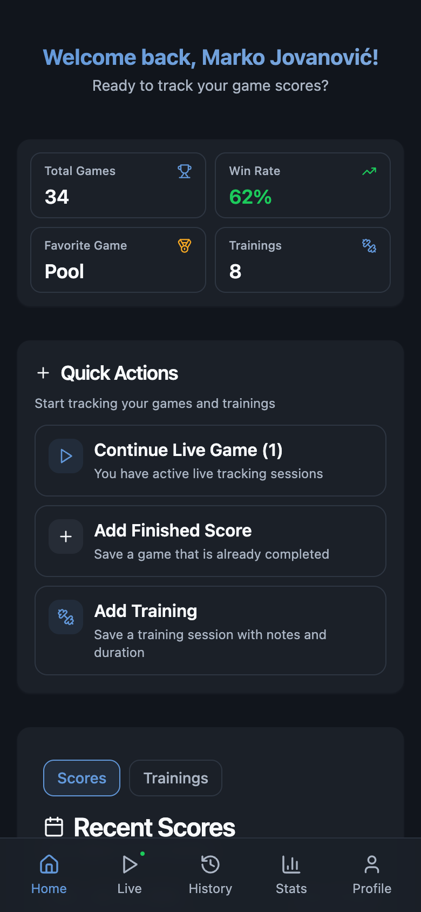       |

## Features

- 🎱 **Live scoring** — track multiple games at once with big tap-to-score tiles, undo,
  haptic feedback and a rack counter. Scores sync in realtime across devices, updates are
  optimistic with debounced writes, and the screen stays awake while a game is running.
- 🖥️ **Scoreboard mode** — fullscreen table-side display with huge scores, tap-half-to-score,
  and a center pill that flips the board 180° so the opponent across the table can read it.
- ⚡ **Quick game setup** — a short wizard: pool takes three steps (rules → opponent → who
  breaks first, with a random-dice option), ping pong just one. A **"Same as last game"** card
  restarts your previous setup in a single tap.
- 🎯 **Pool rules built in** — 8-Ball / 9-Ball / 10-Ball, **alternate** or **winner-stays**
  break rules with an automatic break indicator per rack, and mid-game rule changes.
- 📊 **Statistics** — win rate, W/L record, streaks, last-10 form, average score, a 12-week
  win-rate chart, a GitHub-style activity heatmap, close-game analysis and your best/worst games.
  Filters are opponent-first and deep-linkable (`?opponent=`, `?game=`, `?poolType=`).
- 🤝 **Head-to-head** — pick a friend and get a "You vs …" card with a win split bar, both
  players' recent form, current streak and average score. Opening a friend from the Friends
  page jumps straight to it.
- 📜 **Match history** — day-grouped games with a per-day tally ("You 3-1 Ana"), search,
  game-type and opponent filter chips, and detail sheets with editing.
- 🏋️ **Trainings** — log sessions with duration, title and notes; day-grouped history with
  per-day totals plus dedicated training stats (hours, streaks, heatmap).
- 👥 **Friends** — invite by email with a personal message (or share an invite link), accept or
  decline requests, see head-to-head records, and **watch friends' live games** as a spectator.
- 🔔 **Push notifications** — a friend starting a live game with you sends a push that
  deep-links into the match; per-device subscriptions are managed from Settings.
- 📱 **PWA** — installs to the home screen, runs standalone with app shortcuts, caches offline,
  shows an app-icon badge for active games and launches straight into a running match.
- 🌗 **Light / dark / auto theme** with a picker on the Profile screen.

## Development

React 18 + TypeScript + Vite, Tailwind CSS + shadcn/ui, TanStack Query, and Supabase
(PostgreSQL, Auth, Realtime, Edge Functions). See [CLAUDE.md](CLAUDE.md) for the full
project layout and conventions, and [supabase/LOCAL_SETUP.md](supabase/LOCAL_SETUP.md)
for the local Supabase setup.

```bash
npm install
npm run supabase:start   # local Supabase stack (Docker)
npm run dev:local        # dev server on http://localhost:8080 against local Supabase
npm test                 # Vitest
```

### Demo data

The README screenshots were captured against seeded demo data:

```bash
SERVICE_ROLE_KEY=$(supabase status -o env | grep '^SECRET_KEY' | cut -d'"' -f2) node scripts/seed-demo.mjs
```

The script is idempotent, refuses to run against a non-local Supabase, and creates fictional
users with matches, trainings, friendships and an in-progress live game — all dated relative
to today. Sign in with `marko@demo.test` / `demo1234`.
